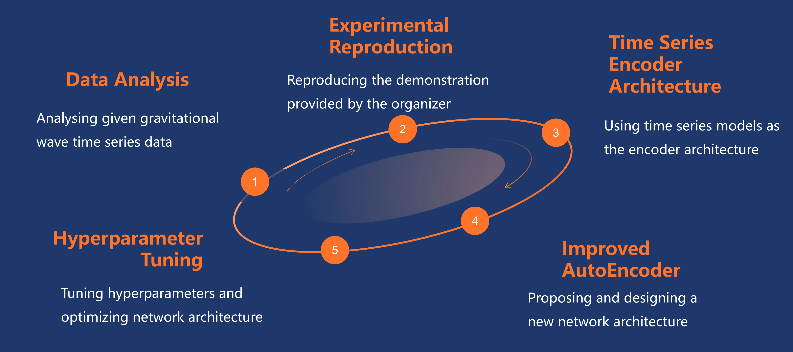

# DEEPGRAV: ANOMALOUS GRAVITATIONAL-WAVE DETECTION THROUGH DEEP LATENT FEATURES

**Team Members:**  
- Jianqi Yan (Department of Physics, The University of Hong Kong)  
- Zhiyuan Pei (Faculty of Innovation Engineering, Macau University of Science and Technology)  
- Alex P. Leung (Department of Physics, The University of Hong Kong)  
- David C. Y. Hui (Department of Astronomy & Space Science, Chungnam National University)  
- Sangin Kim (Department of Astronomy & Space Science, Chungnam National University)

---

### 🚀 Project Updates & Announcements  
- **[March 6, 2025]** 🎉 We released the **first version** of our paper on arXiv.
- **[February 17, 2025]** 🎉 It is honorable for us to get to the **1st Place** in the NSF HDR A3D3 - Detecting Anomalous Gravitational Wave Signals competition.  

---

### Overall Project Overview
This repository contains the training code and submissions for the NSF HDR A3D3 competition, which focused on detecting anomalous gravitational wave signals. 
Our work introduces a novel deep learning-based approach that leverages an improved network architecture inspired by ResNet. 
By incorporating residual blocks and high-dimensional feature projections, our method robustly distinguishes background noise from gravitational wave signals—even on unseen datasets. 
The project demonstrates exceptional prediction performance (with a final True Negative Rate of 0.9832).

For more details, visit [the competition page](https://www.codabench.org/competitions/2626/#).

📚 The paper of this competition is available at the following arXiv link:  
Building Machine Learning Challenges for Anomaly Detection in Science
[https://arxiv.org/html/2503.02112v1](https://arxiv.org/html/2503.02112v1)

---

### Visualizations & Image Summaries

1. **Figure 1: Competition Process Overview**  
   _This figure illustrates the entire workflow of our approach—from data preprocessing and experimental reproduction to the final evaluation in the competition. It summarizes the key steps taken during our participation in the challenge._  
   

2. **Figure 2: Network Architecture Diagram**  
   _This diagram provides a detailed view of our improved convolutional network architecture. It highlights the integration of residual blocks, convolutional layers, batch normalization, and pooling operations that enable efficient high-dimensional feature extraction._  
   

3. **Figure 3: Performance Comparison Plot**  
   _This plot compares the True Negative Rate (TNR) of our model during both the development/validation and final/testing phases. It visually substantiates our model’s superior generalization ability and performance relative to other competitors._  
   

---

### Repository Details
This repository not only contains the code used for training and submission but also documents the experimental process that led to our success in the competition. 
This work was a collaborative effort between the Department of Physics at The University of Hong Kong, the Department of Astronomy & Space Science at Chungnam National University, and the Faculty of Innovation Engineering at Macau University of Science and Technology.
We continue to iterate and improve on our approach, and we look forward to sharing further developments in upcoming releases.

We welcome feedback and contributions to further enhance the robustness of our method.

---

*Note: Additional images and related documentation will be added as the project evolves.*
